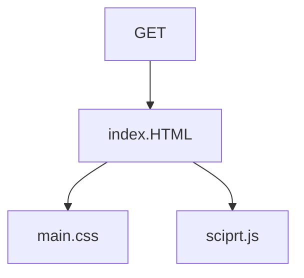
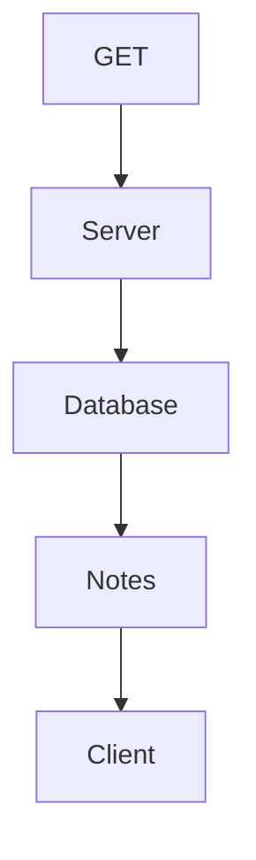

Käyttäjä menee sivulle, jolloin get request lähtee ja lataa html tiedoston. html tiedosto puolestaan lataa CSS ja JavasScript tiedstot.

Aiemmat muistiinpanot ovat todennäköisesti tallennettu johonkin tietokantaan.
Tiedot tallennetuista muistiinpanoista hakeutuvat palvelin puolelta tietokannasta 
