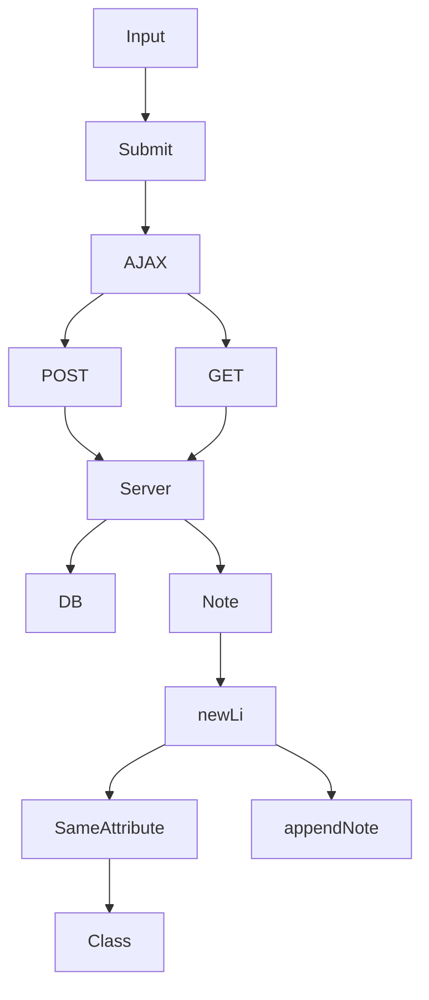

Uuden muistiinpanon tekeminen single page -versiossa tapahtuu ilman sivun päivittymistä uudelleen. 

uusien muistiinpanojen päivittyminen sivulle ilman sivun päivittymistä on mahdollista erilaisilla websocketeilla tai AJAXilla
